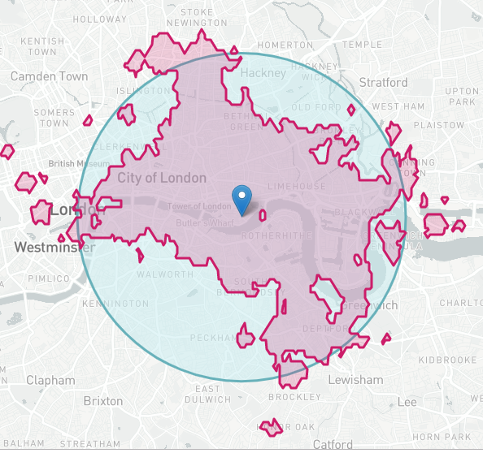
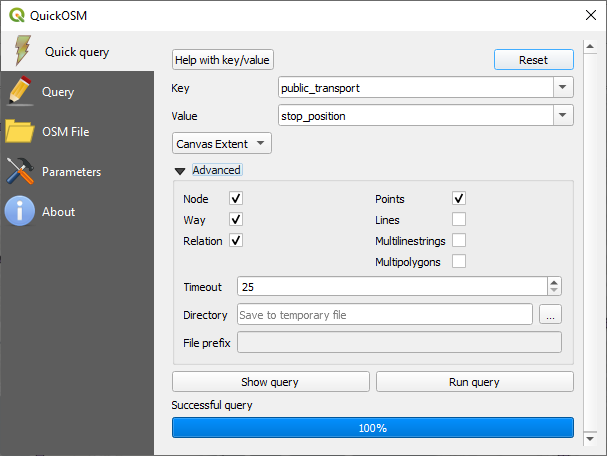
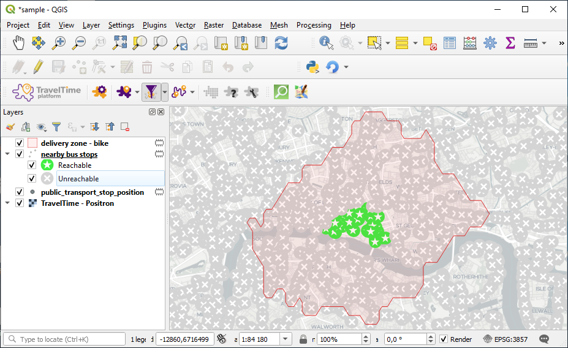
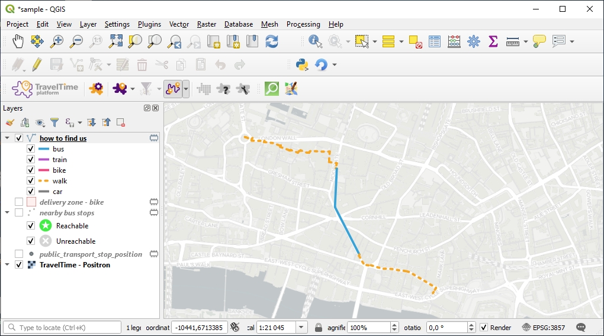

<link rel="stylesheet" type="text/css" href="style.css" />

# Tutorial 01. The Basics 

This tutorial covers basic usage of the TravelTime platform Plugin for QGIS.

To learn more about TravelTime platform and to discuss commercial licences visit [our website](http://traveltimeplatform.com).

<iframe width="560" height="315" src="https://www.youtube.com/embed/HAALMHZQzFM" frameborder="0" allow="accelerometer; autoplay; encrypted-media; gyroscope; picture-in-picture" allowfullscreen></iframe>

## What it is

Travel times are much more accurate than distance to make informed decisions, such as where to locate a new office, what type of transport to choose, or at what time a meeting should start.

*This demonstrates the difference between a normal radius (blue) and a time based reachable area (pink)*

The TravelTime platform Plugin for QGIS adds several algorithms that aim to allow this type of analysis right in QGIS. It works by making use of the TravelTime platform API, an extremely fast web service for such computations.

## What we'll cover

During this tutorial, we'll cover :
- [Installation and setup](#installation-and-setup)
- [Quick overview of the plugin](#quick-overview)
- [Our first steps with TravelTime](#quick-start)
- [Next steps](#what-next)

It is the perfect introduction before diving further into the TravelTime through the more detailed tutorials.

If you are completely new to QGIS or GIS in general, you should still be able to follow this tutorial. You should however refer to the [official QGIS training material](
https://docs.qgis.org/3.4/en/docs/training_manual/index.html) whenever you need to learn more about some QGIS feature.

Also don't forget to refer to the [reference documentation](reference.md) for comprehensive documentation about this plugin. It is also available directly from the plugin using the  help button.

## Installation and setup

First things first, you'll need QGIS. QGIS can be downloaded and installed from [the official website](https://qgis.org/en/site/forusers/download.html). It is a free and open source project, meaning that it is freely available for anyone, and this will forever be the case.

If you are on Windows, make sure to pick the Standalone Installer as it is easier to install.

Once QGIS is installed, launch it.

To install the plugin, open the `Plugin manager` in the `Plugin` menu. In the dialog, search for `TravelTime platform`, and click on install.

If the plugin was installed correctly, you should see a new tool bar.

There's one last step before being able to use the plugin : you need to get a free API key. This is required to be able to use the TravelTime web service. Open the configuration dialog , and click on the `Get free API key button`.

This will open a web page. Fill in the form, and you will get your API key per email. Just copy and paste the `Application ID` and the `API Key` back in the configuration dialog in QGIS.

> Just a note : each API key has a limited quota of requests that can be done in a certain amount of time. This means that your API key may be blocked for some time if you make too many requests over a short period of time. If this happens, just wait a minute or so before doing your next queries. Also make sure to use small datasets, as by default, with the free API key, you can only make up to 10 queries per minute.

  
*An API limit error when running a map tool*

Congratulations! The plugin is now ready for use !

## Quick overview

The main feature of the plugin are three algorithms :
-  **time map**, which allows to get a polygon corresponding to the area that can be covered in a certain amount of time by your chosen mode of transport.
-  **time filter**, which allows to filter a set of points according to the travel time from a certain origin. It calculates the travel time from one origin to up to 2,000 destinations in a single request.
-   **route**, which returns the door to door directions for an optimal route.

Each of these algorithms comes in three versions :
-   **advanced**, the most powerful, that matches as closely as possible the possibilities offered by the web service.
-   **simplified**, a simplified version with fewer parameters, that is easier to use and still covers most use cases.
-   **express**, a map tool version, that allows to run with click inputs rather than layers, which is ideal for a quick start.

Additionally, the plugin offers a few goodies :
-  **geocoding** and  **reverse geocoding**, which allows to translate textual addresses to coordinates or the opposite.
-  **background tiles**, an easy way to add a background to your map.

## Quick start

To get a sense of what the plugin can do, we'll start with the express tools. We'll quickly setup a project to try it out.

### 1. Create a new QGIS project

`Menu > File > New project`

### 2. Add a background layer

To help us navigate the map and actually understand what we look at, we'll add a background layer.

Click on the tiles button  and double click on one of the available XYZ layers. Depending on your API key, you may have just the default XYZ layer or additionnal layers provided by the TravelTime platform.

The background layer should now be added to your project.

### 3. Your first time map

Let's imagine the following scenario : you own a new pizzeria and are thinking of setting up a delivery service. Thus, you want to visualize the area that could be covered by bike delivery in less than 10 minutes, as you want to focus on very fast delivery.

Start by zooming in to a city (choose a popular city like London or New York, so we are sure we'll find some data later on).

Activate the express time map tool by clicking on it's icon . By clicking on the small arrow next to it, you can set the transportation mode to "biking" and the transportation time to 10 minutes. Then, click on the map on a location where you could locate your restaurant.

Your project should look like this (note that the background may look different):

One important thing : notice the small icon next to `Output` in the legend ? This means that `Output` is a temporary layer. This layer won't persist once you close the project. If you want to actually save the results, you can right-click on the layer in the legend, and choose `Make permanent` to save the layer somewhere on your hard drive.

For now, we'll keep it like this. Just to keep things clear, right-click on the `Output` layer in the legend, select `Rename`, and call the layer `delivery zone - bike`.

Let's study our delivery plan a bit more. Change the transportation mode to "driving", and we'll see how things would be if our deliveries were made by car. Click on the same point again, and compare the results.

With "driving", the hour of the day has a great impact because of traffic conditions. Compare what you'd get at 6:30 PM with what you'd get at 8:30 PM, time at which you can expect to do most of the deliveries.

Try out a few more locations / time / transport type combinations. See how the polygon varies according to streets or obstacles, and how it differs from a simple radius. You can also switch the search mode to `arriving`, in which case the time represents the arrival time.

It seems our first guess was the best, as for short durations, the area covered by bike is much bigger. We'll remove all layers except our first `delivery zone - bike`.

### 4. Your first time filter

Your pizzas are great, but the customers are still scarce. You want to make some advertising at the nearby bus stops to invite customers to your restaurant just after they finished their day. Of course, there's no point in advertzing at stops that are too far away, as you estimate that customers wouldn't walk more than 10 minutes from their bus stop to get to your restaurant.

Let's see at what stations you should consider putting ads.

First, we'll need some data : the location of the stations. To get this type of data, we'll use another plugin, the QuickOSM plugin. Go to the plugin manager again, look for QuickOSM, and install it.

Click on the new QuickOSM button , and choose `public_transport` in the key field and `stop_position` in the value field. Choose canvas extent. Unfold the advanced panel, and uncheck lines, multilinestrings and multipolygons, as we'll just work with points feature. Then click run.

You should get a new layer with all the bus stops that were on the current canvas. This is a very powerful way to download OSM's data, which, since it's Open Data, can be used in all of your projects as long as you credit OSM with the `© OpenStreetMap contributors` mention somewhere on your publication.

Make sure you've got a reasonable amount of points (should be less than 2000 points). If you've got too many, zoom in and do the last step again.

Let's now filter these bus stops using the time filter express tool.

Select the layer you just created, then activate the tool by clicking on the icon . Again by pressing on the small arrow next to the button, set 10 minutes by walking. Then click at the location you chose earlier.

The locations will now be filtered between those that are reachable and those that are not. Let's rename this layer `nearby bus stops`. Your project should look like this :

### 5. Your first route

The customers are starting to flow in! But some of them get lost on their way. It seems your pizzeria is a bit hard to find! Let's create some maps that show the best route from some of the main attractions of the city.

Activate the express route tool by clicking on it's icon . Choose `public transport`.

Now click on a point that you identified as your pizzeria, and on a well know location in the city, such as a monument or a central station.

Your project should now look like this :

Congratulations! This concludes our first tutorial. Keep up the good work, an, you'll soon be the #1 pizza seller of your city.

## What next

To learn more, have a look at the next tutorial of the series : **[Tutorial 02. Intermediate](tutorial_02.md)**.

Also don't forget to have a look at the [reference documentation](reference.md), that describes everything the plugin does, as well as at the [TravelTime platform blog](https://blog.traveltimeplatform.com) which includes numerous quality articles around the TravelTime API.
